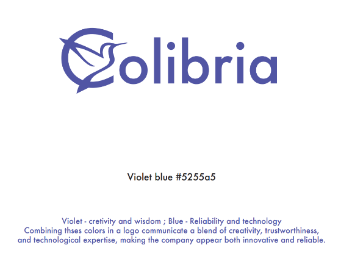
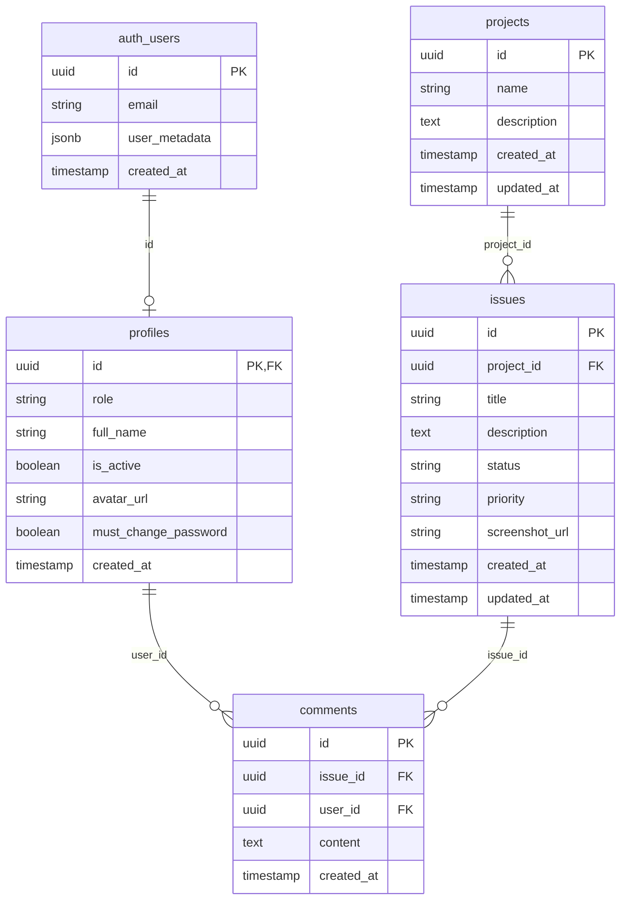
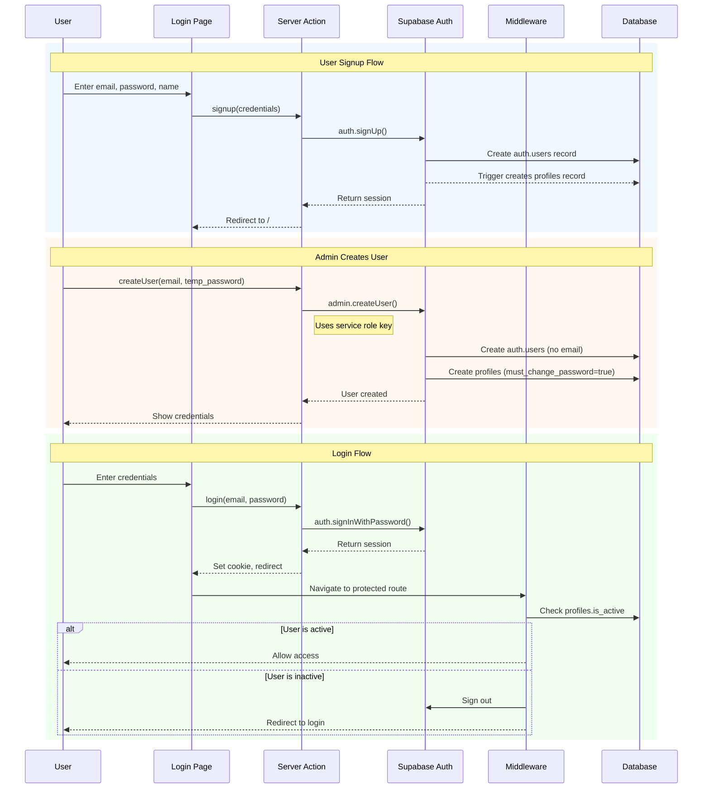

# Colibria Bug Tracker

A simple, elegant bug tracking application for managing projects and logging issues with screenshots.



## Features

- **Project Management** - Create and organize multiple projects
- **Issue Tracking** - Log bugs with detailed descriptions
- **Screenshot Uploads** - Attach visual evidence to issues using drag-and-drop
- **Status Management** - Track issues through Open → In Progress → Closed
- **Priority Levels** - Mark issues as Low, Medium, High, or Critical
- **Clean UI** - Simple, professional interface with Colibria branding

## Tech Stack

- **Next.js 16** - React framework with App Router
- **Supabase** - PostgreSQL database with Row Level Security
- **Vercel Blob** - Secure screenshot storage
- **Tailwind CSS** - Modern styling
- **shadcn/ui** - Beautiful UI components

## Getting Started

### Prerequisites

- Node.js 18+
- pnpm (recommended) - Install with `npm install -g pnpm`
- Supabase account
- Vercel account (for Blob storage)


### Installation

1. Clone the repository
    ```bash
    git clone <your-repo-url>
    cd weco-issue-tracker
    ```

2. Install dependencies
    ```bash
    pnpm install
    ```

3. Set up environment variables
   
    Create a `.env.local` file:
    ```env
    NEXT_PUBLIC_SUPABASE_URL=your_supabase_url
    NEXT_PUBLIC_SUPABASE_ANON_KEY=your_supabase_anon_key
    SUPABASE_SERVICE_ROLE_KEY=your_service_role_key
    BLOB_READ_WRITE_TOKEN=your_vercel_blob_token
    ```

4. Run database migrations in Supabase SQL Editor
    - `scripts/create-profiles-table.sql`
    - `scripts/create-comments-table.sql`
    - `scripts/add-comment-attachments.sql`
    - `scripts/add-project-ownership.sql`
    - `scripts/create-api-keys-table.sql`

5. Start the development server
    ```bash
    pnpm run dev
    ```

6. Open [http://localhost:3000](http://localhost:3000)

### API File Upload Test Scripts

**Linux/macOS:**
```bash
chmod +x ./test-file-upload.sh
API_KEY=your_api_key ./test-file-upload.sh
```

**Windows (PowerShell):**
```powershell
$env:API_KEY="your_api_key"
./test-file-upload.ps1
```

### Package Manager

This project uses **pnpm** for faster, more efficient dependency management. Vercel will automatically detect and use pnpm when deploying.

**Common commands:**
```bash
pnpm install          # Install dependencies
pnpm run dev          # Start dev server
pnpm run build        # Build for production
pnpm run types        # Generate Supabase types
pnpm add <package>    # Add new package
```


## Architecture

### Conceptual Overview

The system is built on a **Next.js 16 App Router** foundation, using a dual data layer and strict separation of concerns:

- **UI Layer:** Next.js Server Components and Client Components (in `components/`), with Server Actions for all UI-triggered mutations.
- **API Layer:** RESTful endpoints under `app/api/` for programmatic access, using API key authentication and rate limiting.
- **Data Layer:** Supabase PostgreSQL (with Row Level Security) and Vercel Blob for file storage.
- **Authentication:** Supabase Auth for user/session management, with a custom API key system for automation and integrations.

#### Service Roles & Supabase Clients

- **Session Client (`createServerClient`)**: Used in Server Actions and UI, respects RLS and user context. Never exposes admin privileges.
- **Service Role Client (`createServiceRoleClient`)**: Used only in admin actions and API key validation. Bypasses RLS for privileged operations (e.g., user provisioning, API key management). Never use in user-facing Server Actions.
- **API Key Context:** API routes use the service role client to validate and update API key usage, but all data access is still performed with the correct user context for RLS enforcement.

#### Row Level Security (RLS)

- **RLS Policies:** All tables have RLS enabled. Policies are defined in `scripts/*.sql` and enforce access based on `auth.uid()` (for session) or API key context.
- **Project Ownership:** The `projects` table has an `owner_id` field, and the `project_members` junction table controls collaboration. RLS ensures only owners/admins can manage members.
- **Admin Bypass:** Service role client is required for admin operations (e.g., creating users, managing API keys), but should never be used in regular UI flows.

#### Server Actions vs API Routes

- **Server Actions (`app/actions/*.ts`):** Used for all UI-triggered mutations. Always validate input with Zod schemas (`lib/validations.ts`). Use `createServerClient()` for RLS-aware queries. Return `{ error }` or `{ data }` objects—never throw.
- **API Routes (`app/api/**/route.ts`):** Used for REST API access. Authenticate with API keys (see `lib/api/auth.ts`). Use `requireApiKey()` for validation and rate limiting. All API routes skip session middleware (see `proxy.ts`).

- **Cache Revalidation:** After any mutation, always call `revalidatePath()` for the affected path(s) to ensure UI consistency.

#### File Uploads

- Use the Vercel Blob API for all file uploads (see `uploadScreenshot()` in `app/actions/issue-actions.ts`). Store only the resulting URL in the database.
- File uploads are limited to 50MB (see `next.config.mjs`).

#### Error Handling

- All Server Actions and API routes return structured error/data objects. Never throw errors to the client.

#### Example Data Flow

1. User triggers a mutation (e.g., create issue) via UI → Server Action validates input, performs RLS-aware DB write, calls `revalidatePath()`.
2. API client calls REST endpoint with API key → API route validates key, checks rate limit, performs operation with correct context.

#### Security Notes

- Never use the service role client in Server Actions or API routes except for admin-only operations.
- Always validate input on the server, even if client-side validation exists.

---

### Database Schema



### Authentication Flow



### Role-Based Access Control (RBAC)

```mermaid
graph LR
    subgraph "Roles"
        USER[User]
        SUPPORT[Support]
        ADMIN[Admin]
    end
    
    subgraph "Permissions"
        VIEW_OWN[View Own Issues]
        COMMENT[Add Comments]
        VIEW_ALL[View All Issues]
        UPDATE_STATUS[Update Issue Status]
        MANAGE_USERS[Manage Users]
        MANAGE_ROLES[Assign Roles]
    end
    
    USER --> VIEW_OWN
    USER --> COMMENT
    
    SUPPORT --> VIEW_OWN
    SUPPORT --> COMMENT
    SUPPORT --> VIEW_ALL
    SUPPORT --> UPDATE_STATUS
    
    ADMIN --> VIEW_OWN
    ADMIN --> COMMENT
    ADMIN --> VIEW_ALL
    ADMIN --> UPDATE_STATUS
    ADMIN --> MANAGE_USERS
    ADMIN --> MANAGE_ROLES
    
- `updated_at` (TIMESTAMPTZ) - Last update timestamp

## Authentication & Database Architecture

The application uses **Supabase Auth** for user management, which separates authentication credentials from application data.

### `auth.users` vs `public.profiles`
- **`auth.users`**: Managed by Supabase. Stores secure credentials (email, encrypted password, metadata). Not directly accessible via the API.
- **`public.profiles`**: A public table linked to `auth.users` via `id`. Stores application-specific user data:
    - `role`: 'user' | 'support' | 'admin'
    - `full_name`: Display name
    - `is_active`: Account status
    - `avatar_url`: Profile picture

### Row Level Security (RLS)
- **Profiles**: Publicly readable by authenticated users. Writable only by the user themselves (limited fields) or Admins.
- **Comments**: Readable by all. Writable only by the author.
- **Issues**: Readable by all (currently). Writable by authenticated users.

### Admin User Provisioning & Email Quota

**Important:** When creating users via the Admin Dashboard, **no confirmation emails are sent** and **no email quota is consumed**.

- **Admin-created users** use `admin.createUser()` with `email_confirm: true`, bypassing the email system entirely
- Users can login immediately with the temporary password provided
- **Email quota only applies to:**
  - Public user signups (confirmation emails)
  - Password reset requests
  - Email change verifications

This means you can provision unlimited users through the Admin UI without worrying about Supabase's free tier email limits (3-4 emails/hour).

## Deployment

### Deploy to Vercel

1. Push your code to GitHub
2. Connect your repository to Vercel
3. Add environment variables in Vercel project settings
4. Deploy!

## License

MIT

## Support

For issues or questions, please open an issue on GitHub.
