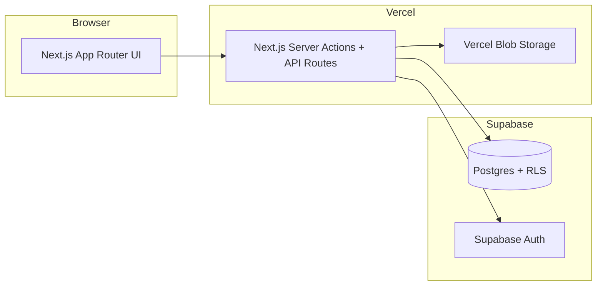
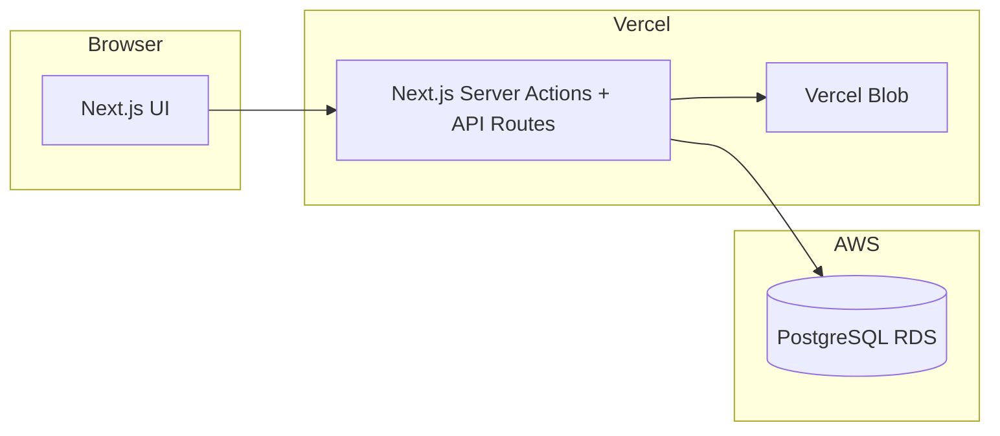
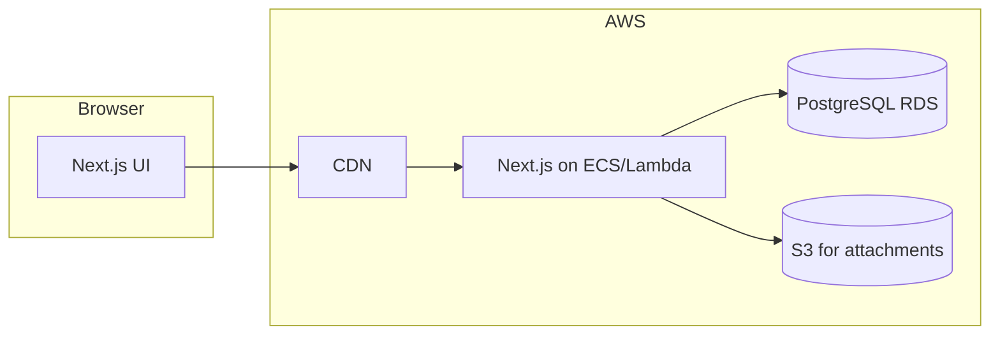

# Feature Map + Product Roadmap

## A) Product Overview

### Original WECO/Odoo problem (fact)
- The tool was created to replace Excel-based issue logs during Odoo/ERP deployments.
- The current UX still reflects a lightweight, low-friction issue capture workflow with screenshots and status tracking.

### Why Excel failed (fact + context)
- Manual spreadsheets are slow to update, hard to search, and easy to diverge across teams.
- The current product centralizes issues in a shared database and adds role-based access controls.

### Why existing tools were not viable (context + hypothesis)
- **Hypothesis:** Cost, complexity, and overhead of Jira/Asana were barriers for a cost-sensitive client.
- **Hypothesis:** A deployment team needed fast capture with minimal ceremony, not heavy workflow configuration.

### What this tool is today (fact)
A lightweight issue tracker with:
- Project + issue management with RLS-backed access control.
- Screenshot and comment attachments via Vercel Blob.
- Admin controls for users, roles, API keys, and impersonation.
- REST API with API-key auth + OpenAPI docs.
- Next.js App Router with Server Actions for UI mutations.

Key entry points:
- UI: `/` (projects list), `/projects/[id]` (issue board), `/login`, `/profile`, `/admin/*`, `/api-docs`.
- Server actions: `app/actions/*`.
- API: `app/api/*`.

CI/CD (fact):
- No repo CI workflows detected in `.github/` besides Copilot instructions, so deployment likely relies on Vercel auto-builds.

---

## B) Current Feature Map (AS-IS)

> **Legend:** Each feature lists user value, primary persona, code locations, data model, and gaps.

### 1) Authentication & user profiles
- **User value:** secure access, profile details, role-based permissions.
- **Primary persona:** delivery team members, admins.
- **Code locations:**
  - Login/signup UI: `app/login/page.tsx`
  - Auth actions: `app/actions/auth-actions.ts`
  - Profile page + update: `app/profile/page.tsx`, `app/actions/profile-actions.ts`
  - Session enforcement: `proxy.ts`
- **Data model:** `profiles` table with `role`, `is_active`, `department`, `region` (`types/supabase.ts`).
- **Gaps / limitations:**
  - No SSO/SAML; only email/password.
  - No audit trail for profile changes.

### 2) Project management
- **User value:** create and organize projects; grant access via membership.
- **Primary persona:** project lead, admin.
- **Code locations:**
  - Project list: `components/project-list.tsx`
  - Project create: `components/create-project-dialog.tsx`, `app/actions/project-actions.ts`
  - Project page: `app/projects/[id]/page.tsx`
  - Membership mgmt: `components/project/manage-members-dialog.tsx`, `app/actions/project-member-actions.ts`
- **Data model:** `projects`, `project_members` (`types/supabase.ts`).
- **Gaps / limitations:**
  - No project-level metadata beyond name/description.
  - No project-level activity feed.

### 3) Issue tracking
- **User value:** log issues with priority/status/component/region and screenshots.
- **Primary persona:** implementation consultants, QA/support, client-side reporters.
- **Code locations:**
  - Create issue: `components/create-issue-dialog.tsx`, `app/actions/issue-actions.ts`
  - Issue list + grouping: `components/issue-list.tsx`
  - Issue detail & status update: `components/issue-details-dialog.tsx`
- **Data model:** `issues` (`types/supabase.ts`).
- **Gaps / limitations:**
  - No assignee, due date, or SLA metadata.
  - No cross-project views or analytics.

### 4) Comments + attachments
- **User value:** collaboration on issues, attach evidence (images/videos).
- **Primary persona:** delivery teams, support.
- **Code locations:**
  - Comment actions: `app/actions/comment-actions.ts`
  - Comment UI: `components/comments/*`
- **Data model:** `comments` with `attachment_url` + `attachment_type` (`types/supabase.ts`).
- **Gaps / limitations:**
  - No threaded comments or mention notifications.

### 5) Search
- **User value:** find issues by title or creator.
- **Primary persona:** project team members.
- **Code locations:**
  - Search UI: `components/issue-search.tsx`
  - Search implementation: `components/issue-list.tsx`
- **Data model:** `issues`, `profiles`.
- **Gaps / limitations:**
  - No full-text search index usage in UI (SQL scripts exist but not wired).

### 6) Admin: user management
- **User value:** manage users, roles, activation.
- **Primary persona:** admin/ops.
- **Code locations:**
  - UI: `app/admin/users/page.tsx`
  - Actions: `app/actions/user-management-actions.ts`
- **Data model:** `profiles` + Supabase auth users.
- **Gaps / limitations:**
  - No audit logs for admin actions.

### 7) Admin: API keys + REST API
- **User value:** programmatic access (integrations, automation).
- **Primary persona:** admin/devops.
- **Code locations:**
  - API key UI: `app/admin/api-keys/page.tsx`, `components/admin/create-api-key-dialog.tsx`
  - API key auth: `lib/api/auth.ts`, `lib/api-keys.ts`
  - REST endpoints: `app/api/**/route.ts`
  - OpenAPI docs: `app/api-docs/page.tsx`, `lib/api/openapi-spec.ts`
- **Data model:** `api_keys` table (`types/supabase.ts`).
- **Gaps / limitations:**
  - API routes use `createServerClient()` (anon context) which may conflict with RLS expectations (see comments in `app/api/projects/route.ts`).
  - Rate limiting is stored in DB only; no per-minute throttling.

### 8) Admin: impersonation
- **User value:** admins can simulate user context for support.
- **Primary persona:** admin/support.
- **Code locations:**
  - Impersonation actions: `app/actions/impersonation-actions.ts`
  - Supabase client impersonation hook: `lib/supabase/server.ts`
- **Data model:** `profiles`.
- **Gaps / limitations:**
  - No visibility or audit trail of impersonation sessions.

---

## C) Market Gap Analysis (WHY Jira/Asana are misfit)

### Overkill and mismatch for ERP delivery teams
- **Process vs. delivery:** ERP projects need fast capture of real-world issues during testing and go-live, not heavyweight workflow configuration.
- **Cost sensitivity:** Low-budget implementations cannot justify per-seat pricing for tools that require extensive setup.
- **Workflow mismatch:** ERP issues are tied to components, environments, data migrations, and phased rollouts, which are not well-modeled in generic tools.

### What low-budget delivery teams actually need
- A fast, low-friction input flow (title + description + screenshot + component + region).
- Lightweight access control (project membership, admin overrides).
- Simple export or API for integration with client reporting.
- Clear auditability without a heavy workflow engine.

### Odoo/ERP project-specific requirements
- Component-based issue taxonomy (modules like Sales, Inventory, Purchasing).
- Phase awareness (UAT, pre-go-live, post-go-live).
- Region/branch/site as first-class metadata (already present in current schema).

---

## D) Product Differentiation Hypotheses (Opinionated)

> **All items below are hypotheses and require validation.**

1. **ERP/implementation-native issue types** (e.g., data migration, configuration, training, integration).
2. **Phase-aware issue lifecycle** (pre-go-live vs. post-go-live impact tracking).
3. **Client-facing vs. delivery-facing views** (simplified client portal, internal triage board).
4. **Lightweight auditability** (exportable change history without heavy workflow engines).
5. **Component + region defaults** tuned for Odoo/ERP projects.
6. **Delivery risk signals** derived from issue volume, age, and component hotspots.
7. **One-click status reporting** for weekly steering updates.
8. **“Project setup in minutes”** default templates for ERP delivery.

---

## E) Roadmap (Phased)

### Phase 0 — Stabilization & free-tier safety
- **Goal:** reduce operational risk while staying on free tiers.
- **Features:**
  - Standardize API auth + RLS context (resolve `createServerClient()` anon context in API routes).
  - Add monitoring baseline (log errors + basic health check).
  - Document migration + backup routine.
- **Dependencies:** Supabase RLS policy alignment, API auth model decision.
- **Risks:** breaking API auth or data access unintentionally.
- **Acceptance criteria:**
  - API routes consistently honor access control.
  - Basic ops checklist exists and can be run manually.
- **Effort:** S–M.

### Phase 1 — Core issue tracking excellence
- **Goal:** make issue capture and triage excellent for delivery teams.
- **Features:**
  - Assignee/owner + SLA fields.
  - Basic reporting: issue counts by status, component, region.
  - Issue templates for ERP flows (config, data, training).
- **Dependencies:** schema updates + UI changes.
- **Risks:** complicating UX or slowing capture flow.
- **Acceptance criteria:**
  - Team can assign and filter issues by owner.
  - Weekly summary can be generated without exports.
- **Effort:** M.

### Phase 2 — Delivery intelligence
- **Goal:** surface insights for delivery leadership.
- **Features:**
  - Trend analytics (volume over time, aging).
  - “Hotspot” indicators by module + region.
  - Basic SLA compliance metrics.
- **Dependencies:** data model consistency, analytics views.
- **Risks:** analytics without enough data volume.
- **Acceptance criteria:**
  - Dashboard highlights top 3 risk areas for each project.
- **Effort:** M–L.

### Phase 3 — Monetizable expansion (without enterprise bloat)
- **Goal:** build paid, repeatable value for consulting teams.
- **Features:**
  - Multi-tenant org management.
  - Export packs for client reporting.
  - Integrations (email ingestion, Slack notifications).
- **Dependencies:** billing + tenancy model.
- **Risks:** scope creep into Jira-like complexity.
- **Acceptance criteria:**
  - At least one paid client pilot with minimal configuration.
- **Effort:** L–XL.

---

## F) Deployment & Infrastructure Strategy

### F1) Current State (Vercel + Supabase Free Tier)

**Architecture (fact)**

**Current usage patterns (fact)**
- Server actions use Supabase session client (`lib/supabase/server.ts`).
- API routes use API key auth (`lib/api/auth.ts`) but data access relies on `createServerClient()` (anon context).
- File uploads go to Vercel Blob (`app/actions/issue-actions.ts`, `app/actions/comment-actions.ts`).
- Next.js config sets server action body limit to 50MB and disables image optimization (`next.config.mjs`).

**Cost & limit risks (hypothesis)**
- Free tiers may hit storage or request limits as usage grows.
- Using Vercel Blob for many screenshots/attachments may become cost-sensitive quickly.

**What could break first (hypothesis)**
- API access under RLS due to missing session context.
- Blob storage limits for attachments.
- Supabase free-tier compute or storage limits.

### F2) Free-Tier Optimization Plan
- **Performance:**
  - Ensure queries select only needed fields for list views.
  - Use pagination in API routes.
- **DB usage:**
  - Avoid wide selects in API routes and UI when not required.
- **Caching:**
  - Use `revalidatePath()` sparingly to avoid over-invalidations.
- **Guardrails:**
  - Add basic rate limiting to API (already uses monthly counters; add per-minute guardrail if needed).
- **Observability:**
  - Minimal error logging + periodic export of API error logs.

### F3) AWS Alternative Architecture

#### Option 1: Minimal-change (Vercel + AWS RDS)

- **Cost posture:** moderate (RDS has baseline cost; keep Vercel/Supabase out).
- **Migration complexity:** medium (replace Supabase client + auth + RLS).
- **Rollback strategy:** maintain Supabase DB for a transition period; dual-write only if required.

#### Option 2: AWS-native (App + DB + storage)

- **Cost posture:** higher fixed cost but more control at scale.
- **Migration complexity:** high (hosting, auth, storage, networking).
- **Rollback strategy:** keep Vercel deployment active; route traffic back via Route53.

### F4) Supabase → RDS Migration (If/When)
- **When it makes sense (hypothesis):**
  - Supabase free tier limits block usage growth.
  - Need full control over auth/RLS beyond Supabase constraints.
- **Tradeoffs:**
  - Lose Supabase Auth + RLS unless replaced with custom solutions.
  - Need new storage for blobs (S3).
- **Migration steps (incremental):**
  1. Extract schema migrations from `scripts/*.sql`.
  2. Stand up RDS and import schema + data.
  3. Replace Supabase client usage with direct Postgres client or ORM.
  4. Re-implement auth (e.g., NextAuth or custom JWT) and permissions.
  5. Migrate attachments from Vercel Blob to S3.
- **Auth/RLS implications:**
  - RLS policies must be re-implemented at app level or via Postgres row policies (without Supabase auth context, you will need custom JWT claims).

---

## Appendix: Environment Variables (names only)
- `NEXT_PUBLIC_SUPABASE_URL`
- `NEXT_PUBLIC_SUPABASE_ANON_KEY`
- `SUPABASE_SERVICE_ROLE_KEY`
- `BLOB_READ_WRITE_TOKEN`
- `NEXT_PUBLIC_APP_URL`
